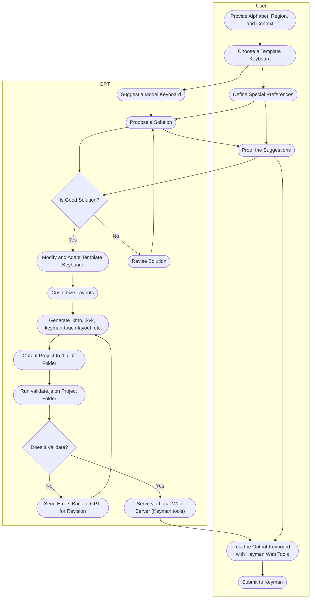

```mermaid
flowchart TD

  subgraph User
    U1(["Provide Alphabet, Region, and Context"])
    U2(["Choose a Template Keyboard"])
    U3(["Define Special Preferences"])
    U4(["Proof the Suggestions"])
    U5(["Test the Output Keyboard with Keyman Web Tools"])
    U6(["Submit to Keyman"])
  end

  subgraph GPT
    G1(["Suggest a Model Keyboard"])
    G2(["Modify and Adapt Template Keyboard"])
    G3(["Customize Layouts"])
    G4(["Generate .kmn, .kvk, .keyman-touch-layout, etc."])
    G5(["Run validate.js on Project Folder"])
    G6{Does it Validate?}
    G7(["Send Errors Back to GPT for Revision"])
    G8(["Propose a Solution"])
    G11{Is Good Solution?}
    G9(["Output Project to /build/ Folder"])
    G10(["Serve via Local Web Server (Keyman tools)"])
    G12(["Revise Solution"])
  end

  U1 --> U2 --> G1 --> G8 -->  G11 -- Yes --> G2 --> G3 --> G4 --> G9 --> G5 --> G6 -- Yes --> G10 --> U5 --> U6
  G6 -- No --> G7 --> G4
  G11 -- No --> G12 --> G8 --> U4 --> G11
  U2 --> U3 --> U4 --> U5
  U3 --> G8
  
```